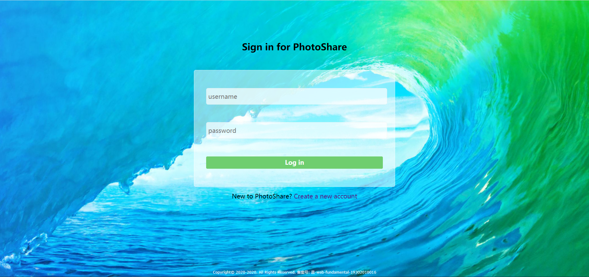
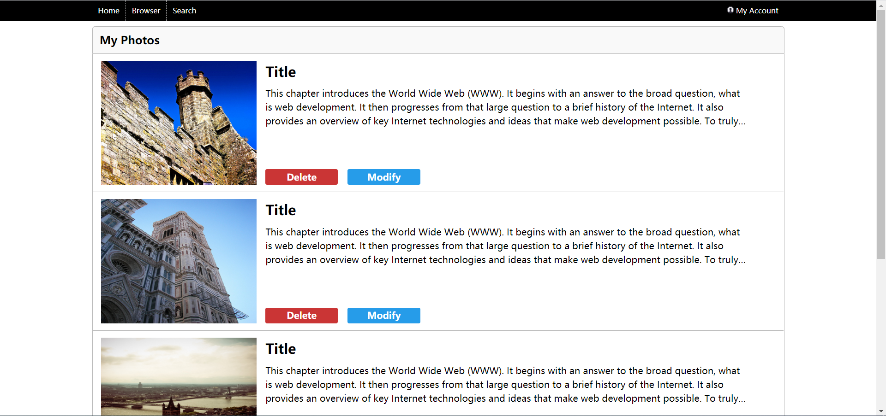
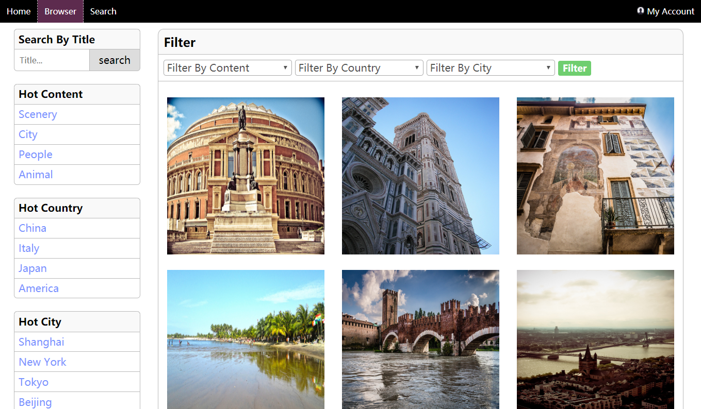
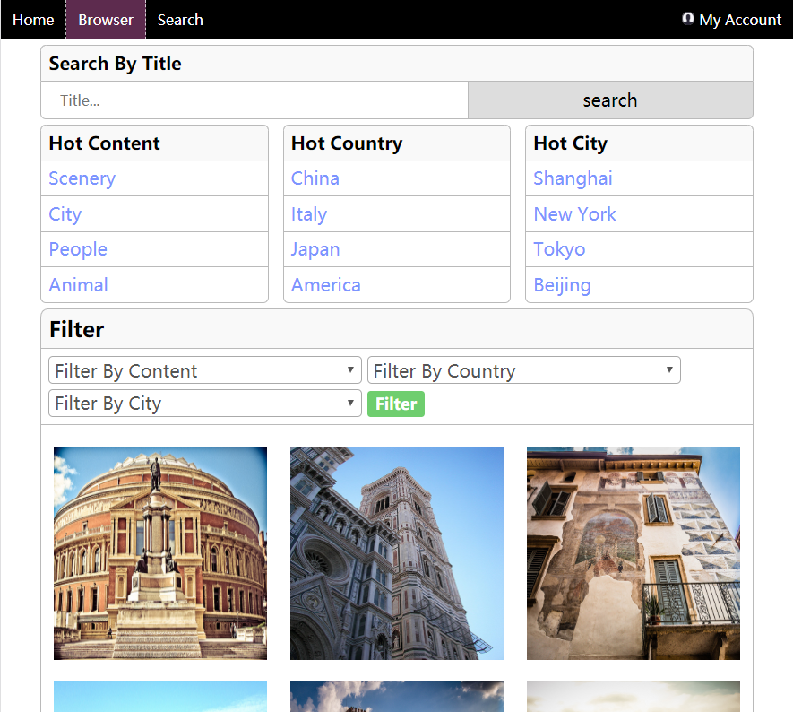
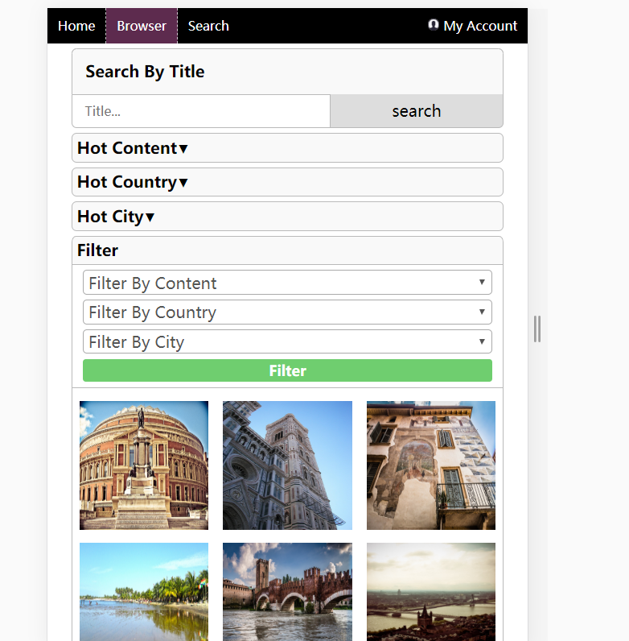

# PJ1开发文档
## 基本信息
+ 姓名：徐赟程
+ 学号：193020100016
+ Github地址：https://github.com/sillyboy51666/SOFT130002_project1
+ Github Pages 地址：https://sillyboy51666.github.io/SOFT130002_project1/
## 项目完成情况
已完成的文档中规定的各项功能

大部分的布局和配色参考的是ta给出的示例截图

js相关的部分通过参考网上的博客等内容初步地完成了，可能不是特别地完善

以下是示例：





## Bonus完成情况与解决方法
### bonus1  
在页面上均使用了自由版式的图片，而不是正方形的图片，同时在缩放浏览器界面的同时图片的大小也会随父元素的大小的变化而变化

主要的实现方法是：

增加了类名是photo-wrapper和img-wrapper的div元素

实现的css代码基本如下：

```
.photo-wrapper {
    position: relative; /*定位img-wrapper*/
    width: 90%;    
    padding-bottom: 90%; /*通过父容器的宽度设定高度*/
}

.photo-wrapper .img-wrapper {
    position: absolute;
    width: 100%;
    height: 100%;}

.img-wrapper img {    
    width: 100%;
    height: 100%;
}
```

由于photo-wrapper的padding-bottom设定的百分比是相对于父容器的宽度而言的，而width的百分比也是相对父容器的宽度而言的，故photo-wrapper的长度和宽度的大小和比例是确定的，同时在缩放浏览器的同时photo-wrapper的长宽也会随之变化

img-wrapper相对于photo-wrapper绝对定位，同时设置高度和宽度都是100%，设置position：absolute为了不在photo-wrapper中留下img-wrapper的空间,否则photo-wrapper中就会出现img-wrapper下方会出现一大片空白的情况

img设置宽度和高度都是100%，填充整个img-wrapper

### bonus2
能够在改变浏览宽度和在移动设备上查看的情况下排版和设计上不出现错乱

主要使用用媒体查询，设置的断点： 500px， 768px， 1200px（少部分设定了1200px）

采用的是桌面设备优先的方法，即先在pc端进行页面设计，设计时采用流式布局，尽量采用百分比来设定布局，字体也是通过em来设定的，再通过媒体查询在浏览器宽度变小时进行样式的变化

对于每一个页面我都基本实现了这个功能，下面简单地介绍一下每个界面的情况

登录和注册界面的变化不大，由于桌面设备空间比较大，表单区域可以在整个屏幕的中间，而移动设备的空间比较有限，故主要的改变在于表单区域在整个页面中的位置，即上下边距，内边距等

上传图片的界面主要在改变预览图的大小比例上

我的收藏和我的照片界面改变的东西也不大，主要也是部分区域的位置，比较特别的是改变了图片的比例，在移动端合理地增大了图片的高度，使得更多文字可以有空间显示出来。搜索页在上述基础上合理改变了表单控件的大小，更适宜移动端用户输入

主页主要的改动在于热门图片区域的展示，宽度小于500px时一行一栏，500px和768px之间时一行一栏， 768px以上是一行三栏

浏览页的变化是比较大的。宽度大于768px时采用左右分栏的设计，搜素，热门内容，热门国家，热门城市在左边，且四者上下有序排列，图片区域在右边；宽度在768px和500px之间时搜素，热门内容，热门国家，热门城市则在图片区域的上方，且后三者排布在同一行；宽度小于500px时热门内容，热门国家，热门城市会以下拉菜单的形式，更大化地利用屏幕，使用户能很快看到主要的内容

这里的示例是关于浏览页的：







### bonus3  
个人认为做出了自身代码能力和审美能力范围内较为美观的界面，整体画面还是比较和谐的

## 对PJ1与本门课的意见与建议

PJ1非常有趣，通过PJ1熟练了html和css的使用，同时也学到了很多东西！建议助教能在平时的lab中给出一些简单的代码演示
